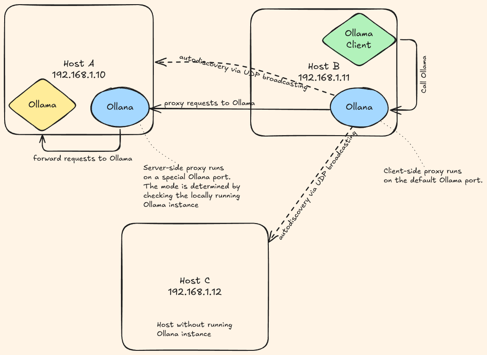

# Ollana (Ollama Over LAN)

Auto-discover your Ollama server on your local network with hassle-free ease.

Use your home or office Ollama server from any device on the same network without changing settings in your client applications or setting up a reverse proxy.

## Table of Contents

- [Why](#thinking-why)
- [Installation](#installation)
- [Usage](#man-usage)
- [Architecture](#pencil-architecture)
- [Contributing](#handshake-contributing)
- [License](#judge-license)

## :thinking: Why

- No need to know an IP address of a Ollama server. 
- No need to change the configuration of your client applications.
- Secure the network traffic via TLS
- Provide simple AuthZ/AuthN

## Installation

### :dvd: Binaries

The pre-compiled binaries for Linux and MacOS are available for download on the [Releases](https://github.com/grouzen/ollana/releases) page

### :memo: From source

Requires [Rust](https://rustup.rs/) (Edition 2021).

```sh
git clone https://github.com/grouzen/ollana.git
cd ollana
cargo build --release
# or via cargo install
cargo install --path .
```

### :penguin: Linux distros

#### Gentoo linux

It is available via `lamdness` overlay

```sh
sudo eselect repository enable lamdness
sudo emaint -r lamdness sync
sudo emerge -av app-misc/ollana
```


## :man: Usage

### Allow devices

First thing you need to do before running a proxy is to set up authorization between your Ollana server and client.
This process requires approving the unique Device IDs for both the server and client on each end.

For this, you need to get the Device IDs of both server and client by running the following command on each machine:

```sh
$ ollana device show
# SHA-256 hash of the X.509 certificate that's automatically generated upon running any ollana command (including this one)
Device ID: b596c4e40002ec65f12edbe0adc116739dd52f62e7ed2a691230cd62c16aa4dc 
```

You need to copy the Device IDs and allow them on both sides by running:

```sh
$ ollana device allow b596c4e40002ec65f12edbe0adc116739dd52f62e7ed2a691230cd62c16aa4dc
Added Device ID: 435ea545d8cd0287073e8fb672a451849d2a803c0cae321ba98c675951fe41de
```

#### Device management

Surprisingly you can also see the allowed Device IDs:

```sh
$ ollana device list
Allowed Device IDs:
b596c4e40002ec65f12edbe0adc116739dd52f62e7ed2a691230cd62c16aa4dc
```

And disable them as well:

```sh
$ ollana device disable b596c4e40002ec65f12edbe0adc116739dd52f62e7ed2a691230cd62c16aa4dc
Removed Device ID: b596c4e40002ec65f12edbe0adc116739dd52f62e7ed2a691230cd62c16aa4dc
```

### Serve

Now you can run a proxy.
It automatically detects the mode (client or server) to run in by checking whether an Ollama server is running on your machine.

```shell
$ ollana serve
```

It also support an old-style SysV daemon mode to run in a background:
```shell
$ ollana serve -d
```

#### Run as a system service

It is recommended to run it as a background process. This repository doesn't contain scripts for any particular start up system.

You can find a SystemD and OpenRC scripts in my Gentoo overlay: https://github.com/grouzen/lamdness-overlay/tree/main/app-misc/ollana/files.

For example, here is the [Systemd unit](https://github.com/grouzen/lamdness-overlay/blob/main/app-misc/ollana/files/ollana.service):
```
[Unit]
Description=Ollana Service
After=network-online.target

[Service]
EnvironmentFile=-/etc/conf.d/ollana
ExecStart=/usr/bin/ollana serve $OLLANA_OPTS
User=ollana
Group=ollana
Restart=always
RestartSec=3

[Install]
WantedBy=default.target
```

## :pencil: Architecture



See also [architecture-overview.md](docs/architecture-overview.md) for more details.


## :handshake: Contributing

Auto-reloading development server (see: https://actix.rs/docs/autoreload)

```shell
watchexec -e rs -r cargo run
```

### Debugging

You can debug the application by setting the `RUST_LOG` environment variable to the desired level of verbosity. For example, to enable debug level:
```shell
RUST_LOG=debug ollana serve
```


## :judge: License

MIT

See [LICENSE](LICENSE) file.
