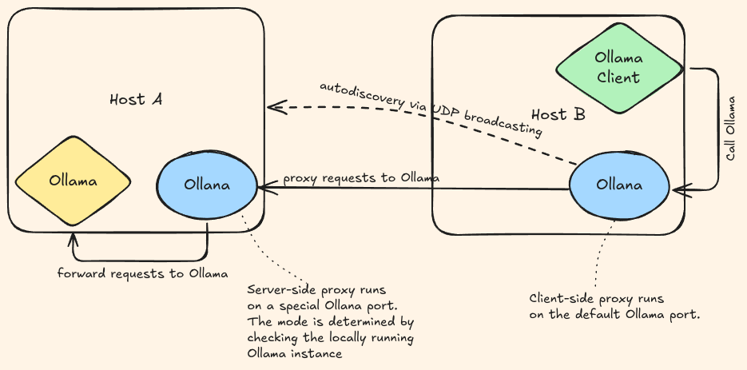

# Ollana (Ollama Over LAN)

Auto-discover your Ollama server on your local network with hassle-free ease.

Use your home or office Ollama server from any device on the same network without changing settings in your client applications or setting up a reverse proxy.

## Table of Contents

- [Why](#thinking-why)
- [Installation](#installation)
- [Usage](#man-usage)
- [Architecture](#pencil-architecture)
- [Contributing](#handshake-contributing)
- [License](#judge-license)

## :thinking: Why

- No need to know an IP address of a Ollama server. 
- No need to change the configuration of your client applications.
- Secure the network traffic via TLS
- Provide simple AuthZ/AuthN

## Installation

### :dvd: Binaries

The pre-compiled binaries for Linux and MacOS are available for download on the [Releases](https://github.com/grouzen/ollana/releases) page

### :memo: From source

Requires [Rust](https://rustup.rs/) (Edition 2021).

```sh
git clone https://github.com/grouzen/ollana.git
cd ollana
cargo build --release
# or via cargo install
cargo install --path .
```

### :penguin: Linux distros

#### Gentoo linux

It is available via `lamdness` overlay

```sh
sudo eselect repository enable lamdness
sudo emaint -r lamdness sync
sudo emerge -av app-misc/ollana
```


## :man: Usage

### Serve

Run a proxy.
It automatically detects the mode (client or server) to run in by checking whether an Ollama server is running on your machine.

```shell
ollana serve
```

It also support an old-style SysV daemon mode to run in a background:
```shell
ollana serve -d
```

## :pencil: Architecture



See also [architecture-overview.md](docs/architecture-overview.md) for more details.


## :handshake: Contributing

Auto-reloading development server (see: https://actix.rs/docs/autoreload)

```shell
watchexec -e rs -r cargo run
```

### Debugging

You can debug the application by setting the `RUST_LOG` environment variable to the desired level of verbosity. For example, to enable debug level:
```shell
RUST_LOG=debug ollana serve
```


## :judge: License

MIT

See [LICENSE](LICENSE) file.
