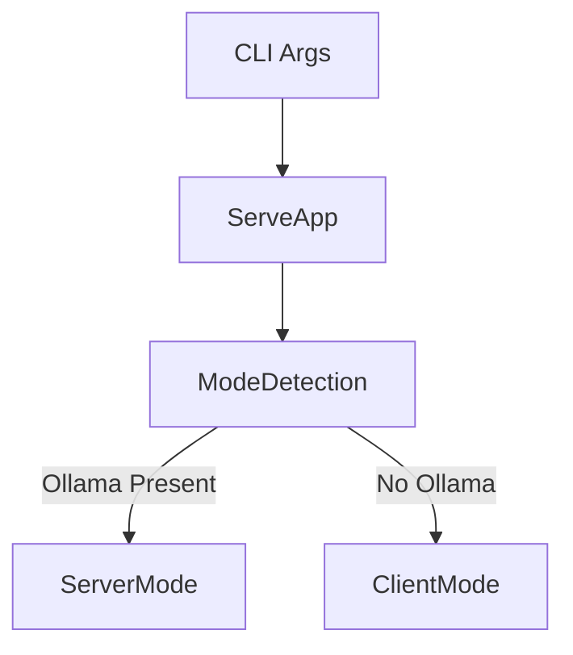
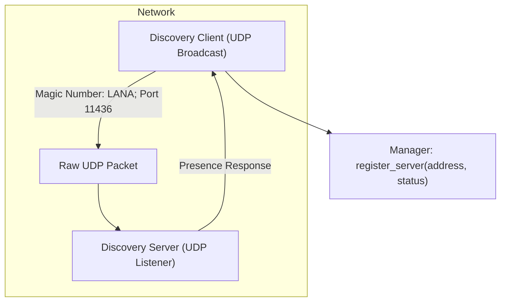
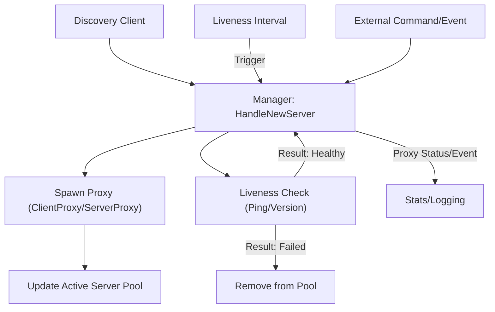
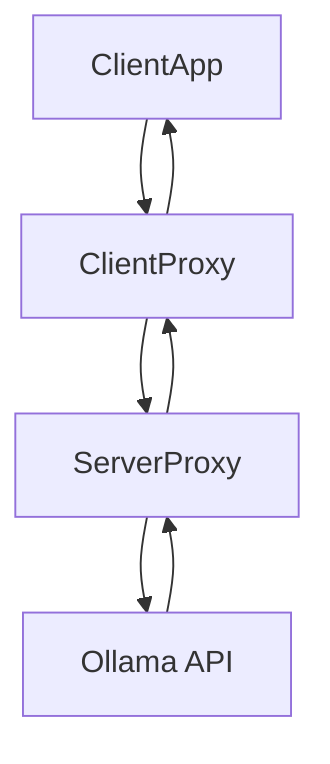
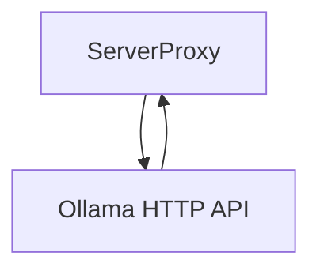
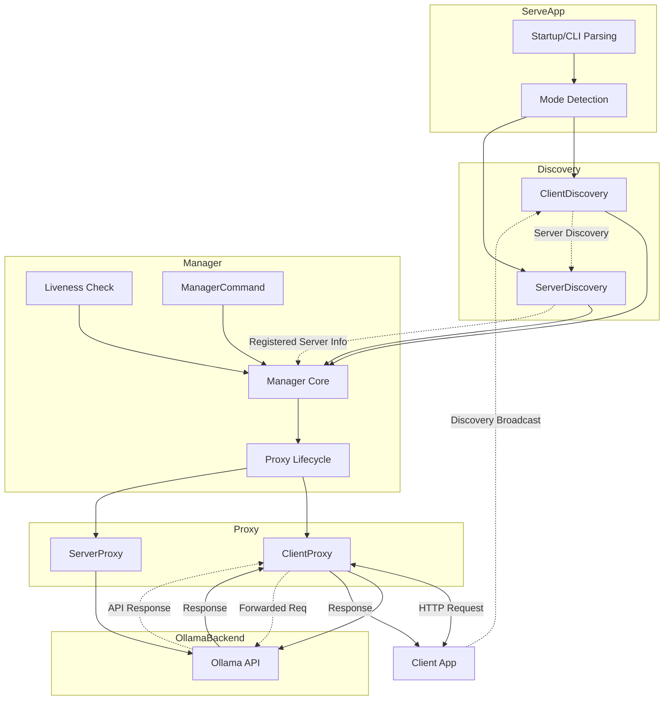

# Ollana Architecture Overview

This document provides an overview of the Ollana system, which automatically discovers and manages Ollama servers across a LAN, transparently proxying client requests.

## Key Components

### ServeApp

Handles CLI startup, configuration parsing, and determines run mode (client or server) by checking for a local Ollama instance.

#### Data Flow

**Description:** ServeApp receives command-line arguments, parses configuration, and inspects whether Ollama is active locally. It triggers either ServerMode or ClientMode logic accordingly.

---

### Discovery

Enables auto-discovery of servers and clients on the LAN via UDP broadcast and listen.

#### Technical Details
- **Protocol:** Uses UDP broadcasts with the magic number `0x4C414E41` ("LANA") on port `11436` (from [`AGENT.md`](AGENT.md:36)). Clients broadcast every 5 seconds to locate servers.
- **Server Response:** Servers listen for broadcasts and reply with presence announcements.
- **Registration:** Upon receiving server responses, clients register the available servers with Manager.
- **Error Handling:** Discovery ensures retries and ignores invalid responses.

#### Extended Data Flow

**Description:** The DiscoveryClient sends a broadcast packet containing identifying data. DiscoveryServer listens for these and, upon receipt, sends a UDP reply announcing its availability. DiscoveryClient then registers the responding servers via an internal channel/message to the Manager.

---

### Manager

Central orchestrator, tracking active servers, managing proxies, performing health (liveness) checks, and registering/disconnecting servers.

#### Technical Details
- **Manager State:** Maintains a pool (map/list) of discovered servers and their statuses (active, healthy, last seen).
- **Proxy Lifecycle:** Spawns proxies for each new server found; terminates proxies for dead/unresponsive servers.
- **Liveness Monitoring:** Periodically checks each registered server (ping or version API requests, see [`src/manager.rs`](src/manager.rs:166)). Updates status and removes unresponsive servers.
- **Command Handling:** Receives events (ManagerCommand) for adding/removing servers, updating status, and proxy state transitions.
- **Concurrency:** Fully asynchronous; uses channels and async functions for communication and control (Tokio runtime).

#### Extended Data Flow

**Description:** Upon receiving a new server registration from Discovery, Manager adds it to the active server pool and spawns a proxy for it. Periodically, Manager checks the liveness of each server, updating their status accordingly. On failure, dead servers are removed and proxies are shut down. The manager also handles commands for updating proxies, logging, and interfaces with higher-level orchestration.

---

### Proxy (ClientProxy & ServerProxy)

Implements HTTP proxying between clients and Ollama servers. ClientProxy works on user machines; ServerProxy operates on Ollama hosts.

#### Data Flow

**Description:** Client applications send HTTP requests to the ClientProxy, which forwards them to the ServerProxy on the discovered server. The ServerProxy relays requests to the actual Ollama API and returns responses along the same path.

---

### Ollama Backend

The actual Ollama API instance. Processes model inference requests, returns responses.

#### Data Flow

**Description:** Receives proxied requests, processes them, and returns either success or error responses to ServerProxy, which then transmits them back to the originating client via the proxy chain.

---

## Combined Component and Request Flow

## Notes

For further technical details, see [`AGENT.md`](AGENT.md:1) and Excalidraw diagrams for network-level interactions, port mapping, and behavioral nuances.